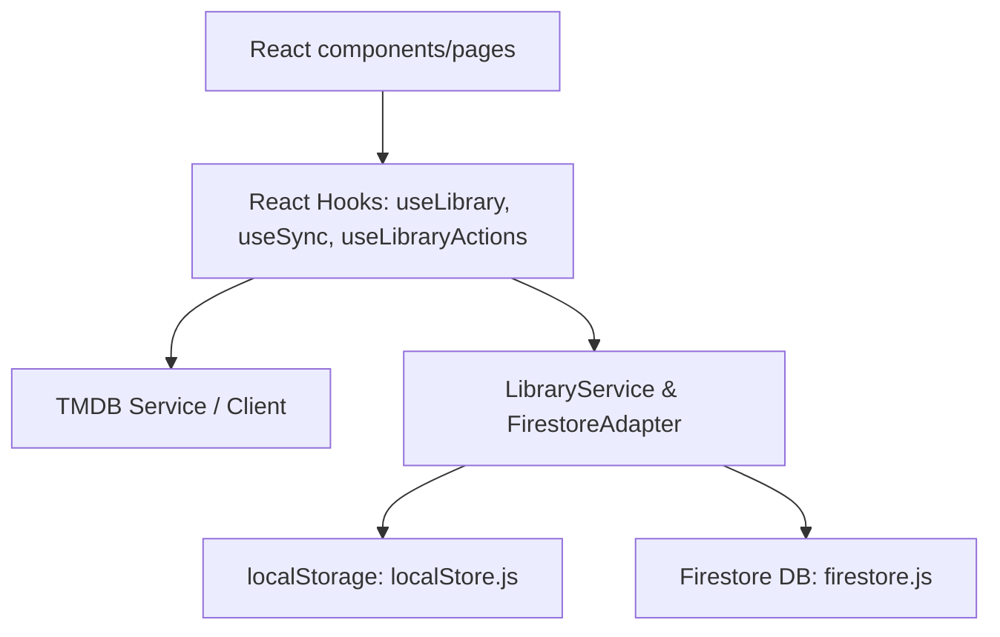

# Project Memory & Architecture Context

This document serves as the project memory bank for `movie-log`. It documents the system design, boundaries, dependencies, and rules to guide future architectural refinements and feature additions.

---

## 1. Current Boundaries & Architecture Separation

The application is structured into the following functional domains:

### Core Modules
1. **Offline State / Cache (`src/storage/localStore.js`)**:
   - Manages reads and writes to `localStorage` (key: `movie-log-library` and `movie-log-meta`).
   - Acts as a dumb, fast key-value local cache for instant UI bootstrapping.
2. **Cloud Layer / Firestore Adapter (`src/sync/firestoreAdapter.js`, `src/firebase/firestore.js`)**:
   - Sets up Firestore client connection.
   - Enforces offline persistence cache backend.
   - Handles row-level operations (reads, updates, soft-deletes) and batch operations (writes).
   - Dynamic schema pruning (sanitizers) to store only minimal tracking data in Firestore.
3. **Synchronizer / Orchestrator (`src/sync/libraryService.js`, `src/sync/migration.js`)**:
   - Coordinates incremental delta synchronization and guest-to-account migration rules.
   - Connects local storage cache state with the Firestore database layer.
   - Merges conflict items using rule-based resolution (`src/sync/mergeRules.js`).
4. **Media & TMDB Integration (`src/services/tmdbClient.js`, `src/services/tmdbService.js`)**:
   - Centralizes calls to The Movie Database (TMDB) REST API.
   - Normalizes raw TMDB payloads into the internal schema format.
   - Implements request batching, rate-limiting, and automatic API key pool rotation.
5. **State Management & Actions Hooks (`src/context/`, `src/hooks/`)**:
   - React contexts (`AuthContext`, `LibraryContext`) expose state globally.
   - Custom hooks (`useLibraryActions`, `useSync`) abstract operations and guard against race conditions using transaction tracking refs.

---

## 2. Rules & Technical Standards

### Firestore Schema Minimization
Firestore documents in the user's `library` subcollection MUST NOT store display metadata (e.g. title, poster image paths, overview text, or genres lists). They must only store state and identifiers:
- `tmdb_id` (Number)
- `media_type` ("movie" | "tv")
- `status` ("watched" | "watching" | "wishlist" | "completed")
- `rating` (Number 1-10 or null)
- `dateAdded` (ISO String)
- `updatedAt` (ISO String)
- `progress` (Object: `{ watchedEpisodes: Array, percentComplete: Number }` for TV only)

All other movie metadata is fetched from TMDB and merged client-side during synchronization and item hydration.

### Soft Deletion
Items deleted by users are not physically deleted from Firestore to prevent syncing conflicts across offline clients. Instead, they are marked as:
- `deleted: true`
- And their key is added to the user's tombstone map at `/users/{uid}/meta/general` in the `deletedItems` field.

---

## 3. Pending/Future Refinements
- **Clearer Boundaries**: Transition from hooks making direct service calls to a cleaner repository pattern.
- **Sync/Media Decoupling**: Encapsulate TMDB metadata fetching strictly behind the services layer so sync logic never deals with API keys or raw TMDB endpoints.
- **Offline Cache Sync**: Fully utilize Firestore's offline queue instead of custom synchronizer overrides when online state shifts.
